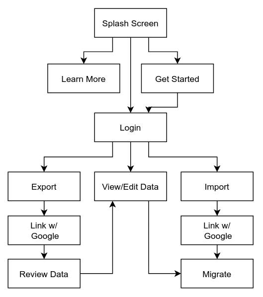

# YouTube Data Migrator Proposal

## Goal

This app aims to migrate data between YouTube accounts by exporting and
importing data through the app with the assistance of the YouTube API.

[Google Identity](https://developers.google.com/identity/sign-in/web/sign-in)  
[YouTube Data API v3](https://developers.google.com/youtube/v3/getting-started)

The interface is intended to be very simple, familiar, and mobile-friendly to
appeal to the average user.  Target users Users who may want to retire an old
Google account would encounter difficulty due to transferring YouTube data
(playlists, likes, watch later, subscriptions) to a new Google account.

## Data needs

Frontend needs will be handled with Axios, JavaScript, JQuery, material design,
and Google fonts unless circumstances change.

Backend needs will be handled with Python, PostgreSQL, Flask, and SQLAlchemy.
The API used will be the YouTube Data API v3.

Authentication is handled with the Google Identity platform.

The YouTube API credentials are obtained for free through the Google Admin
Console.

## Outline

User data that can be exported at the user's choice will only include the
user's channel subscriptions, liked videos, and any user-created playlists
along with their content.

The application will not handle saving or migrating the user's own videos,
comments, view history, watch later, added playlists, or other data not
otherwise mentioned.

Login will be handled with BCrypt and JWT. Linking YouTube will be handled with the
Google API, and authentication with OAuth. All user data will be deleted
automatically after two weeks.

Due to API usage quota, this means that exporting the user's YouTube data will
use up little quota cost, however importing that data will cost 50 out of the
default 10,000 quota per resource inserted, which means only roughly 190 items
can be migrated per day.

This limitation is of little concern at the moment since this is an
educational/experimental app running off Heroku, however if it appears to be a
success I will consider more appropriate hosting and can make a request to
YouTube for a quota increase accordingly.

The user can save their data to a file, although the importing of data will
only use the exported data on the server side, rather than importing from a
user-provided file.

## User Flow

## Database Schema

